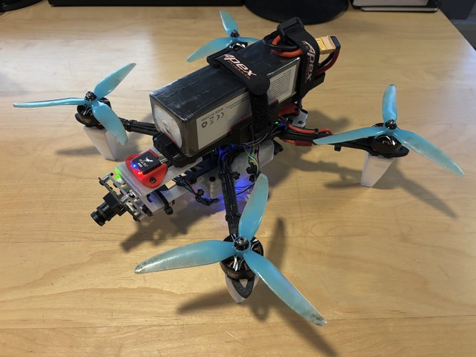

    
     
    <h3>ardupilot-rpi</h3>
    

    MAVLINK Scripts used in my Ardupilot to Raspberry Pi connection for automatic video recording via Arducam.
    

     
    <a href="https://loganfick.com/projects/drone">See my post on my Website</a>

<!-- TABLE OF CONTENTS -->

  
Table of Contents

  <ol>
    <li><a href="#description">Project Description</a></li>
    <li><a href="#files">File Structure</a></li>
    <li><a href="#contact">Contact</a></li>
    <li><a href="#acknowledgments">Acknowledgments</a></li>
    <li><a href="#license">License</a></li>
  </ol>

<!-- DESCRIPTION -->
## Description

lorem

<!-- CONTACT -->
## Files

lorem

<!-- CONTACT -->
## Contact

Logan Fick -  loganfickcontact@gmail.com

Project Link: [https://github.com/weasalcrafter/projects/drone](https://github.com/weasalcrafter/projects/drone)

Website: [https://loganfick.com/](https://loganfick.com/)

<!-- ACKNOWLEDGMENTS -->
## Acknowledgments
lorem

* [lorem](lorem)

## License

This project is licensed under the MIT License - see the [LICENSE](LICENSE) file for details.
